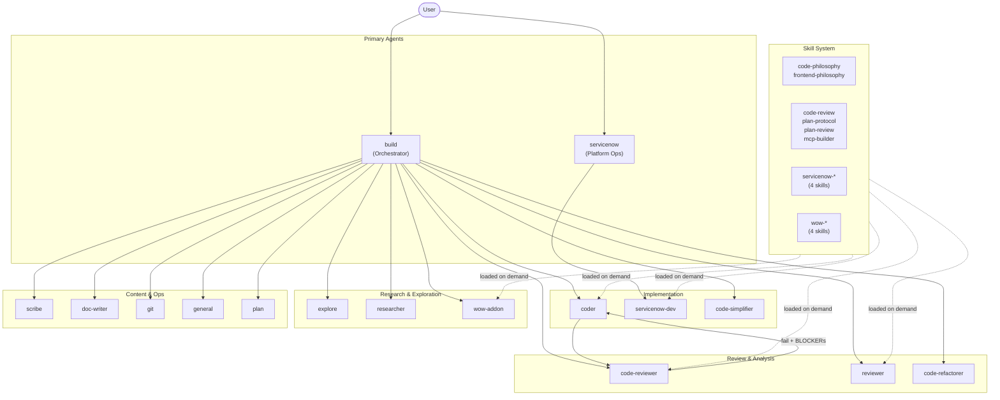
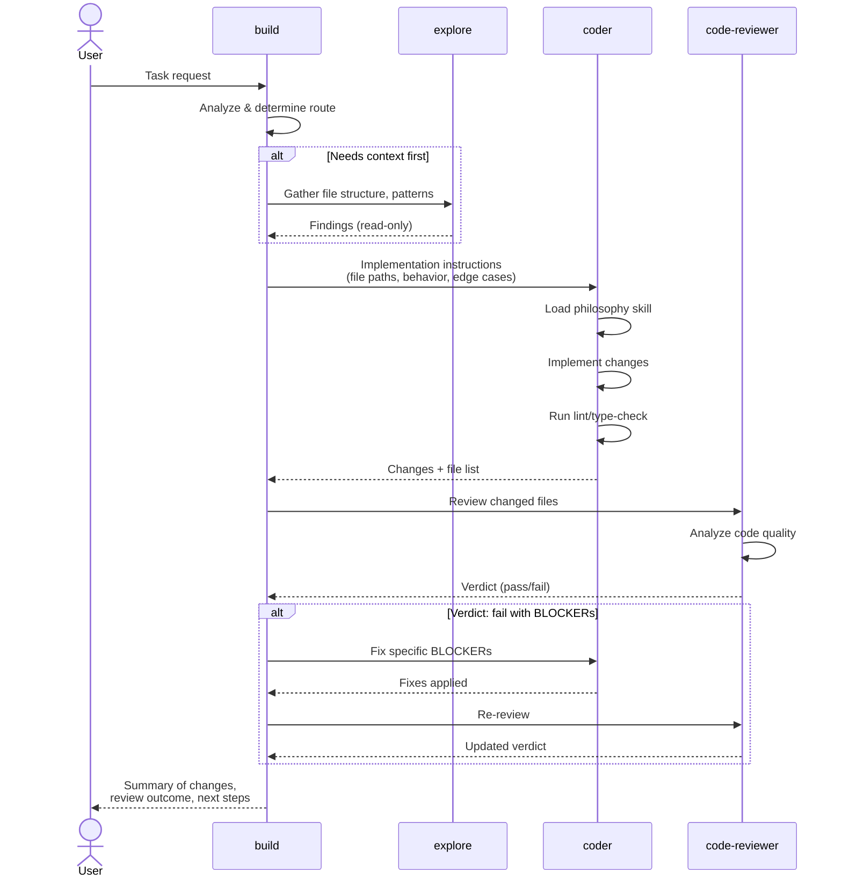
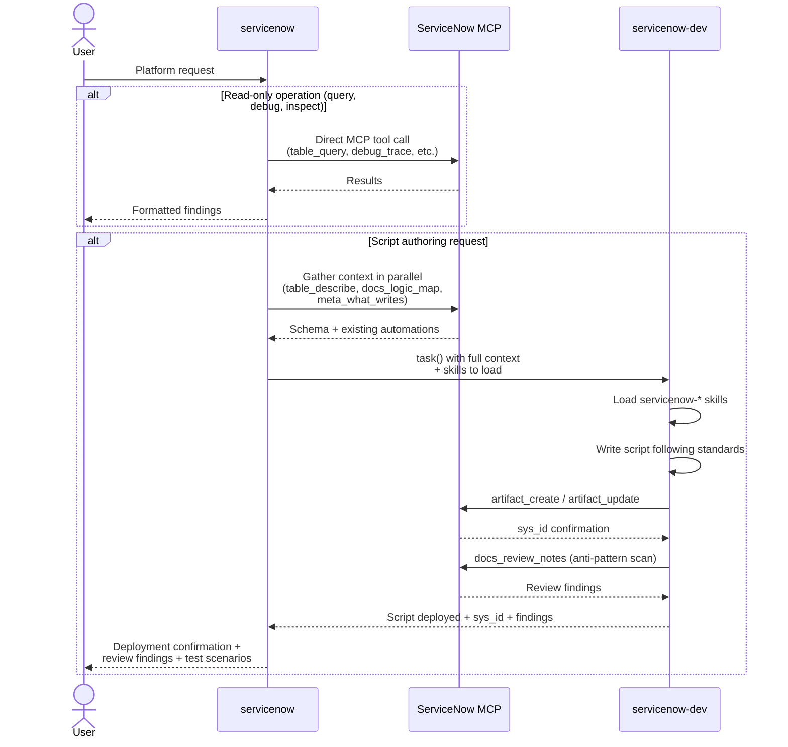
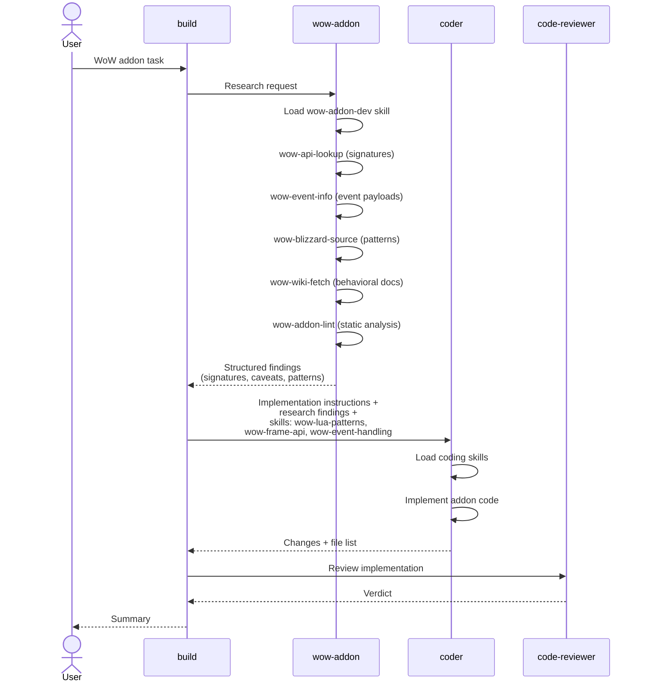
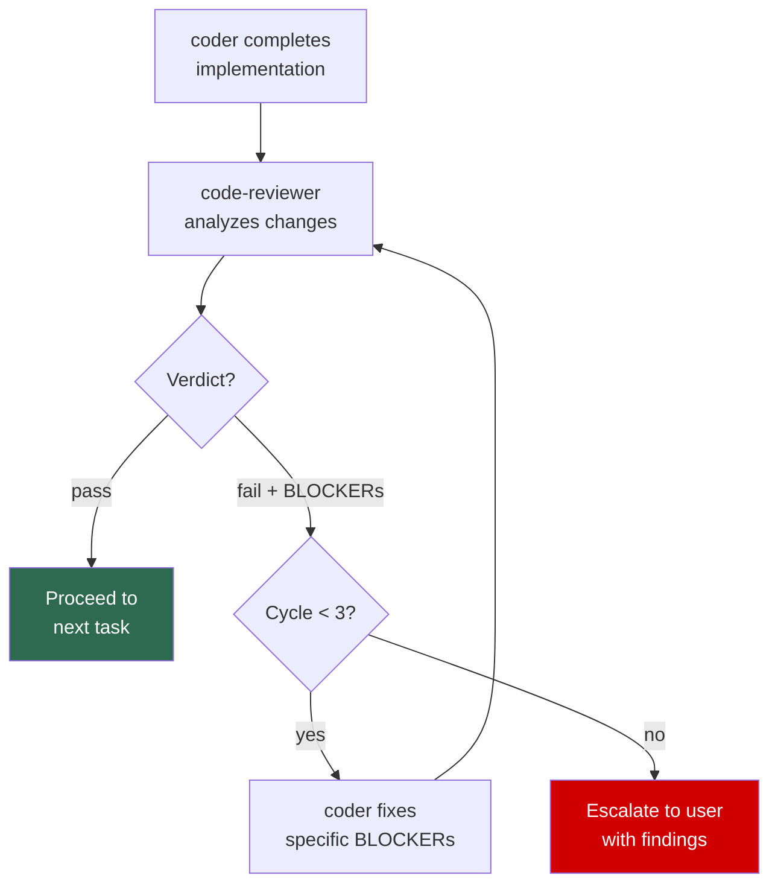

# Agent Orchestration System

A multi-agent AI development environment with role separation, mandatory quality gates, philosophy-driven development, and domain specialization for ServiceNow and WoW addon development. Built on [OpenCode](https://opencode.ai), the system routes every task through the right specialist - from research to implementation to review - enforcing code quality standards at every step.

## 📐 Architecture Diagram



## 📋 Agent Registry

16 agents with strict role separation. Each agent has a single responsibility and cannot exceed its defined authority.

| Agent | Role | Mode | Model | Key Constraint |
|-------|------|------|-------|----------------|
| `build` | Orchestrator - routes tasks, never implements | primary | (env default)^1^ | Cannot edit files or run commands directly |
| `coder` | Code implementation, file editing, command execution | subagent | claude-opus-4.6 | Must load philosophy before any code change |
| `code-reviewer` | Post-implementation review, pass/fail verdict | subagent | (default) | Read-only - reviews but never fixes |
| `code-refactorer` | Identifies refactor opportunities | subagent | (default) | Read-only - proposes but never implements |
| `code-simplifier` | Simplifies code preserving behavior | subagent | (default) | Only touches recently modified code |
| `explore` | Fast codebase search and analysis | subagent | (default) | Read-only - cannot modify files |
| `researcher` | External research, web access, structured findings | subagent | gpt-5.4-mini | Returns information only - never implements |
| `scribe` | Human-facing prose, changelogs, README files | subagent | gpt-5.4-mini | Writes prose, not code |
| `doc-writer` | Technical documentation, API refs, architecture docs | subagent | (default) | Documents only what exists in code |
| `reviewer` | Expert review - security, performance, philosophy | subagent | claude-sonnet-4.6 | Deep analysis mode - read-only |
| `git` | Git/GitHub CLI operations only | subagent | (default) | Cannot edit files - executes git/gh commands only |
| `wow-addon` | WoW addon domain research with 5 custom tools | subagent | (default) | Research only - does not write code |
| `servicenow` | ServiceNow platform ops - queries, debugging, introspection | primary | (env default) | Read-only ops; delegates all script writing |
| `servicenow-dev` | ServiceNow script authoring, deploys via MCP | subagent | (env default) | Writes and deploys artifacts to instance |
| `general` | Multi-step parallel execution, heterogeneous tasks | subagent | (default) | Used when no single specialist fits |
| `plan` | Implementation plan creation | subagent | claude-sonnet-4.6 | Plans only - does not implement |

^1^ `build` does not specify a model in `opencode.jsonc`. It inherits from the system/environment default (typically set via the `OPENCODE_MODEL` env var or provider config).

## 🔄 Core Flows

### 4.1 Primary Flow (Build Orchestrator)

The `build` agent is the central hub. It never implements directly - it analyzes the user's request, gathers context, delegates to the right specialist, and synthesizes results.



### 4.2 ServiceNow Flow

The `servicenow` agent is a separate primary agent with direct MCP access to ServiceNow instances. It handles all read-only platform operations directly and delegates script authoring to `servicenow-dev`.



### 4.3 WoW Addon Flow

WoW addon development splits research and implementation across specialized agents. The `wow-addon` agent has 5 custom tools for domain research; the `coder` agent handles implementation with WoW-specific coding skills.



### 4.4 Review Loop

Every implementation delegation triggers a mandatory code review. The loop enforces quality with a hard cap of 3 cycles to prevent infinite loops.



**Review rules:**

- BLOCKERs must be fixed before proceeding
- Non-blocking observations are informational only - they do not block progress
- Maximum 3 review cycles before escalating to the user
- The `code-reviewer` never fixes code itself - it returns a verdict and the `coder` implements fixes

## 🧠 Skill System

Skills are on-demand knowledge modules loaded at runtime. They inject domain-specific instructions, patterns, and quality standards into an agent's context when needed. Skills are not always-on - they are loaded explicitly when a task matches their domain.

### Philosophy Skills (mandatory for code changes)

| Skill | Purpose |
|-------|---------|
| `code-philosophy` | The 5 Laws of Elegant Defense - guard clauses, parsing at boundaries, atomic predictability, fail-fast, intentional naming |
| `frontend-philosophy` | The 5 Pillars of Intentional UI - typography, color, motion, composition, atmosphere |

### Process Skills

| Skill | Purpose |
|-------|---------|
| `code-review` | 4-layer review methodology with severity classification and confidence thresholds |
| `plan-protocol` | Implementation plan format with citations |
| `plan-review` | Plan quality criteria for reviewing implementation plans |
| `mcp-builder` | Guide for creating MCP servers (Python FastMCP or Node/TypeScript SDK) |

### ServiceNow Skills

| Skill | Purpose |
|-------|---------|
| `servicenow-scripting` | Server-side scripting standards - Script Includes, class patterns, error handling, naming |
| `servicenow-business-rules` | Business Rule timing, filter conditions, anti-patterns, delegation to Script Includes |
| `servicenow-client-scripts` | Client-side patterns - onChange guards, GlideAjax, g_scratchpad, UI Policies |
| `servicenow-gliderecord` | GlideRecord/GlideAggregate best practices - query patterns, getValue/setValue, aggregation |

### WoW Addon Skills

| Skill | Purpose |
|-------|---------|
| `wow-addon-dev` | Core tool reference and LuaLS API annotations (research agent only) |
| `wow-lua-patterns` | Namespace pattern, global caching, SavedVariables, metatables, mixins, slash commands |
| `wow-frame-api` | Frame creation, widget types, anchoring, backdrop, textures, animations, taint avoidance |
| `wow-event-handling` | Event registration, dispatching, ADDON_LOADED bootstrapping, combat lockdown guards |

### Skill Routing Rules

The `build` agent routes skills to the right agents:

- **All code changes**: `code-philosophy` (always), `frontend-philosophy` (when UI/styling involved)
- **WoW addon code**: `wow-lua-patterns`, `wow-frame-api`, `wow-event-handling` (as relevant)
- **ServiceNow scripts**: `servicenow-scripting` (always), plus type-specific skills
- **Never**: `wow-addon-dev` to `coder` - that skill documents research tools only the `wow-addon` agent can use

## 🛡 Philosophy Enforcement

Quality enforcement operates at three layers, creating defense-in-depth against shipping non-compliant code.

### Layer 1: Global Instruction (`philosophy/AGENTS.md`)

The zero-exceptions rule applied to every agent via the global instructions list:

> Every code change requires a loaded philosophy. No load, no code. If you already started writing - stop, load it, then resume.

### Layer 2: Agent Enforcement

- **`coder`** has a Prime Directive: load the relevant philosophy skill before ANY implementation
- **`build`** specifies which skills to load when delegating to `coder`
- Philosophy loading is not optional - the agent system prompt makes this non-negotiable

### Layer 3: Review Enforcement

- **`code-reviewer`** checks for philosophy compliance as part of every review
- **`reviewer`** performs deep philosophy audits for critical or complex changes
- Non-compliance is a BLOCKER that triggers the fix loop

### The 5 Laws of Elegant Defense (Code Philosophy)

- [ ] **Early Exit** - Guard clauses handle edge cases at function tops; nesting depth stays under 3 levels
- [ ] **Parse Don't Validate** - Data parsed at boundaries, trusted internally; no redundant validation
- [ ] **Atomic Predictability** - Pure functions where possible; side effects isolated and explicit
- [ ] **Fail Fast, Fail Loud** - Invalid states halt immediately with descriptive errors; no silent swallowing
- [ ] **Intentional Naming** - Code reads like English; names describe return values; no abbreviations

### The 5 Pillars of Intentional UI (Frontend Philosophy)

- [ ] **Typography** - Distinctive, non-generic fonts
- [ ] **Color** - Bold, committed color choices
- [ ] **Motion** - Purposeful, orchestrated animations
- [ ] **Composition** - Brave, asymmetric layouts
- [ ] **Atmosphere** - Depth through gradients and textures

## 🔐 Permission Model

The system uses a deny-by-default architecture. Every capability is globally denied, then selectively enabled per-agent based on what that agent's role requires.

### Global Defaults (`opencode.jsonc` top-level `permission`)

```
read: allow          -- all agents can read files
write: deny          -- no agent can write by default
edit: deny           -- no agent can edit by default
glob: deny           -- no agent can glob by default
bash: { "*": deny }  -- no agent can run commands by default
task: deny           -- no agent can delegate by default
webfetch: deny       -- no agent can fetch URLs by default
worktree_*: deny     -- no agent can manage worktrees by default
```

All MCP tools are also globally denied (`servicenow_*: deny`, `wow-*: deny`, `context7_*: deny`, `exa_*: deny`, `gh_grep*: deny`, `atlassian_*: deny`, `sonarqube_*: deny`, `kagi_*: deny`).

### Per-Agent Overrides

Each agent's `permission` block enables only what it needs:

| Agent | Write | Edit | Bash | MCP Tools | Task | Other |
|-------|-------|------|------|-----------|------|-------|
| `build` | no | no | no | no | yes | worktree_* |
| `coder` | yes | yes | build/lint/search tools | no | no | - |
| `code-reviewer` | no | no | git read-only, rg, diff | no | no | plan_read, delegation_read |
| `code-refactorer` | no | no | git read-only, rg | no | no | plan_read, delegation_read |
| `code-simplifier` | yes | yes | build/lint tools, rg, diff, file inspection | no | no | - |
| `explore` | no | no | file inspection, git read-only | no | no | - |
| `researcher` | no | no | gh/npm/pip read-only, text tools | context7, exa, gh_grep, webfetch | no | - |
| `reviewer` | no | no | git read-only, rg | no | no | plan_read, delegation_read, delegation_list |
| `scribe` | yes | yes | no | no | no | - |
| `doc-writer` | yes | yes | no | no | no (denied) | - |
| `git` | no | no | git *, gh * | no | no | - |
| `plan` | no | no | no | no | yes | worktree_* |
| `wow-addon` | no | no | no | wow-* (5 tools), webfetch | no (denied) | - |
| `servicenow` | no | no | no | servicenow_* | yes | - |
| `general` | no | no | no | no | no | (global defaults only) |
| `servicenow-dev` | yes | yes | no | servicenow_* | no | - |

### External Directory Whitelist

File operations outside the workspace are restricted to explicitly whitelisted paths:

```
/Users/lasn/.plannotator/**        -- Plannotator data
/Users/lasn/.local/share/wow-annotations/**  -- WoW API annotations
/Users/lasn/Projects/**            -- Project directories
```

### Bash Command Pattern Matching

Bash permissions use glob patterns for fine-grained control:

```jsonc
// coder: build tools and file inspection allowed
"bash": {
  "*": "deny",
  "bun *": "allow",
  "npm *": "allow",
  "tsc *": "allow",
  "rg *": "allow",
  // ... 40+ specific patterns
}

// git: only git and gh commands
"bash": {
  "*": "deny",
  "git *": "allow",
  "gh *": "allow"
}
```

## ⚙ Safety Guardrails

Multiple layers prevent accidental damage, credential exposure, and production incidents.

### 1. Credential Protection Plugin (`sn-credential-protection.ts`)

A runtime plugin that intercepts file writes and git operations:

- **Blocks** file writes containing hardcoded ServiceNow credentials (passwords, URLs with embedded creds)
- **Blocks** `git add` of `.env`, `.env.local`, and `.env.*` files
- **Warns** on `git add .` or `git add -A` to verify `.gitignore` coverage
- Matches 6 credential patterns via regex (ServiceNow passwords, URLs, Glide servlet credentials)

### 2. Production Warning Plugin (`sn-production-warning.ts`)

A runtime plugin that blocks write operations against production ServiceNow instances:

- **Detects** production via `SERVICENOW_ENV` environment variable or instance URL pattern analysis
- **Blocks** 20+ write operations (record CRUD, artifact deployment, ITSM record creation/updates, property changes)
- **Allows** preview operations (`record_preview_*`) - they are read-only
- Non-production is identified by URL suffixes: `-dev`, `-test`, `-sandbox`, `-uat`, `-staging`, `-qa`, `-demo`, `-training`, `-lab`

### 3. Permission System

Least-privilege per agent (see Permission Model above). Each agent can only use the tools its role requires.

### 4. Philosophy Enforcement

Prevents shipping non-compliant code through the 3-layer enforcement system (see Philosophy Enforcement above). Code that violates the 5 Laws or 5 Pillars is blocked at review.

### 5. Review Loops

Every implementation triggers a mandatory code review. Maximum 3 cycles prevent infinite loops - after 3 failed reviews, the system escalates to the user rather than continuing autonomously.

### 6. Agent Isolation

- Subagents cannot delegate to other agents (leaf agents)
- The `build` orchestrator cannot edit files or run commands
- Read-only agents (`explore`, `code-reviewer`, `code-refactorer`, `reviewer`) have write/edit permissions explicitly denied

## 🔌 External Integrations

### MCP Servers

7 MCP servers are configured, providing agents with access to external services and domain-specific tools:

| Server | Type | Purpose | Enabled Agents |
|--------|------|---------|----------------|
| `servicenow` | local (uv) | ServiceNow instance ops - record CRUD, artifact deployment, debugging | `servicenow`, `servicenow-dev` |
| `context7` | remote | Library documentation lookup | `researcher` |
| `exa` | remote | Web search and content retrieval | `researcher` |
| `gh_grep` | remote | GitHub code search across repositories | `researcher` |
| `sonarqube` | local (Docker) | Code quality and static analysis | none (globally denied) |
| `atlassian` | remote (OAuth) | Atlassian/Jira/Confluence integration | none (globally denied) |
| WoW tools | built-in | 5 addon research tools (api-lookup, wiki-fetch, event-info, blizzard-source, addon-lint) | `wow-addon` |

`sonarqube` and `atlassian` are configured and enabled at the MCP layer but their tools are globally denied (`sonarqube_*: deny`, `atlassian_*: deny`). No agent currently has override permissions for them - they must be explicitly granted per-agent before use.

### Plugins

3 npm plugins and 2 local plugins extend agent behavior at runtime:

| Plugin | Purpose |
|--------|---------|
| `sn-credential-protection.ts` (local) | Blocks credential leaks in file writes and git operations |
| `sn-production-warning.ts` (local) | Blocks write operations against production ServiceNow instances |
| `@tarquinen/opencode-dcp` | DCP (Developer Control Plane) integration |
| `@franlol/opencode-md-table-formatter` | Markdown table auto-formatting |
| `@plannotator/opencode` | Plannotator annotation and review UI integration |

## 📟 Slash Commands

12 slash commands provide one-shot workflows that combine agent routing, context gathering, and structured output.

| Command | Agent | Purpose |
|---------|-------|---------|
| `/review` | build (delegates to `reviewer`) | Code review pipeline - staged changes, recent commits, or specified files |
| `/sn-debug` | servicenow | Full record debug - traces lifecycle, field mutations, flow executions, email chains |
| `/sn-health` | servicenow | Run all 7 investigation modules and summarize findings |
| `/sn-logic-map` | servicenow | Generate lifecycle logic map of all automations on a table |
| `/sn-review` | servicenow | Code review pipeline for a ServiceNow platform artifact |
| `/sn-updateset` | servicenow | Inspect update set members, risk flags, and generate release notes |
| `/sn-write` | servicenow | Script authoring pipeline - gather context, delegate to servicenow-dev, deploy |
| `/wow-review` | wow-addon | WoW addon code review - static analysis, API verification, pattern checks |
| `/wow-scaffold` | wow-addon | Scaffold new addon project with full directory structure, Ace3, CI, and TOCs |
| `/plannotator-annotate` | build | Open interactive annotation UI for a markdown file |
| `/plannotator-review` | build | Open interactive code review for current changes |
| `/plannotator-last` | build | Annotate the last assistant message |

## 🔀 Coordination Patterns

### Parallel Delegation

When tasks are independent, the `build` agent launches multiple agents simultaneously:

```
explore (find file structure)  +  researcher (look up library docs)
code-reviewer (review file A)  +  explore (gather context for next task)
scribe (write changelog)       +  doc-writer (update API docs)
wow-addon (research API)       +  explore (find current usage)
```

**Rule:** Never parallelize tasks that depend on each other's output.

### Sequential Chains

When output feeds into the next step, wait for completion:

1. `explore` finds relevant files and patterns
2. `coder` implements the change informed by that context
3. `code-reviewer` reviews the implementation
4. `coder` fixes any BLOCKERs if review fails

**Rule:** Never guess at intermediate results - wait for actual output.

### Research-Then-Implement

For non-trivial tasks, gather context before delegating to `coder`:

1. Delegate to `explore` or `researcher` to understand the current state
2. Synthesize findings into specific, actionable implementation instructions
3. Delegate to `coder` with concrete file paths, expected behavior, and edge cases
4. Follow with mandatory code review

This pattern prevents wasted implementation cycles from incomplete context.

### Multi-File Changes

For changes spanning multiple files, delegate to `coder` once with a clear file list:

- All files to be modified, in dependency order
- The relationship between changes (e.g., "new type in types.ts, consumed in handler.ts")
- Any constraints on ordering or compatibility

**Rule:** Do not create one delegation per file - the coder needs the full picture for consistency.

### Context Management

The `build` agent compresses completed work to maintain a sharp context window:

- Compress after major milestones (feature complete, review passed, task done)
- Keep the most recent delegation results uncompressed for reference
- Prefer multiple small compressions over one massive compression
- When a review loop closes, compress the review exchanges
